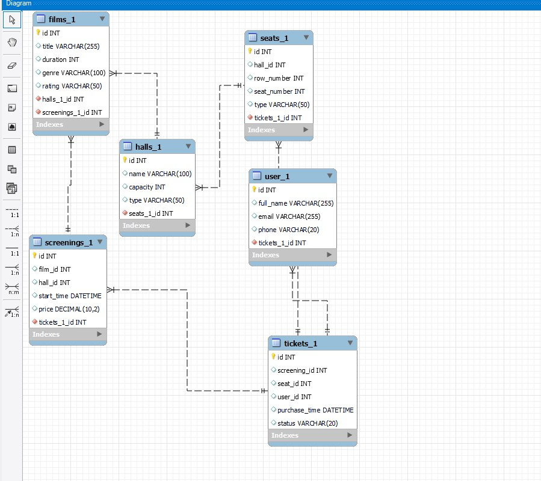

# Платформа онлайн-кинотеатра CinemaStream

CinemaStream — это современная веб-платформа для просмотра фильмов и сериалов онлайн. Проект объединяет обширную медиатеку, персонализированные рекомендации и удобный интерфейс для комфортного просмотра контента в любое время и с любых устройств.

## Решаемые проблемы
- **Для зрителей**: сложность поиска качественного контента среди тысяч фильмов, отсутствие персонализированных рекомендаций, необходимость подписки на несколько платформ одновременно.
- **Для правообладателей**: ограниченные каналы дистрибуции контента, сложности с монетизацией архивных и нишевых фильмов.
- **Для кинопроизводства**: недостаточная аналитика аудитории для принятия решений о производстве нового контента.
- **Для пользовательского опыта**: фрагментированный просмотр на разных устройствах, потеря прогресса просмотра, сложная навигация по каталогу.

## Основные возможности
- 🎬 **Обширная медиатека** с фильмами и сериалами различных жанров, годов выпуска и стран производства
- 🎯 **Персонализированные рекомендации** на основе истории просмотров, оценок и предпочтений пользователя
- 📱 **Кроссплатформенность** — доступ с компьютеров, смартфонов, планшетов и Smart TV
- 📊 **Умный поиск** с фильтрацией по жанрам, актёрам, режиссёрам, году выпуска и рейтингу
- 🎞️ **Продолжение просмотра** — автоматическое запоминание момента остановки на всех устройствах
- 📝 **Система рейтингов и отзывов** для формирования сообщества кинолюбителей
- 👨‍👩‍👧‍👦 **Семейные профили** — до 5 индивидуальных профилей в одной подписке
- 💾 **Офлайн-просмотр** — возможность загрузки контента для просмотра без интернета
- 🔍 **Детальная информация** о фильмах: трейлеры, актёрский состав, интересные факты, рецензии критиков

## Ценность проекта
CinemaStream обеспечивает:

- **Удобство**: Единая платформа с тысячами фильмов вместо поиска по разным сервисам
- **Персонализацию**: Алгоритмы рекомендаций, которые учатся на ваших предпочтениях
- **Доступность**: Разные тарифные планы (с рекламой, базовый, премиум) для любой аудитории
- **Качество**: Контент в 4K HDR с многоканальным звуком для истинных киноманов
- **Сообщество**: Возможность делиться мнениями, создавать списки фильмов и следить за друзьями
- **Аналитику для студий**: Детальные данные о просмотрах, демографии аудитории и популярности контента
- **Глобальную доступность**: Локализованный контент с субтитрами и дубляжом на разных языках
- **Технологичность**: Современный плеер с адаптивным битрейтом, поддержкой HDR10+ и Dolby Vision

## Технологические преимущества
- ☁️ **Облачная инфраструктура** для масштабирования в периоды высокой нагрузки
- 🤖 **AI-рекомендации** на основе машинного обучения
- 🔒 **Защита контента** с помощью DRM-технологий
- 📡 **Адаптивная потоковая передача** для стабильного просмотра при любом качестве интернета
- 🗺️ **Геолокационные лицензии** для соблюдения прав на распространение контента в разных регионах

## Бизнес-модель
- **Подписочная модель**: Ежемесячная/ежегодная оплата доступа ко всей библиотеке
- **Администрация контента**: Партнёрские программы с киностудиями и независимыми производителями
- **Дополнительные услуги**: Аренда новинок до их появления в подписке, покупка фильмов в постоянную коллекцию
- **Партнёрские интеграции**: Совместные предложения с интернет-провайдерами, производителями устройств и мобильными операторами

